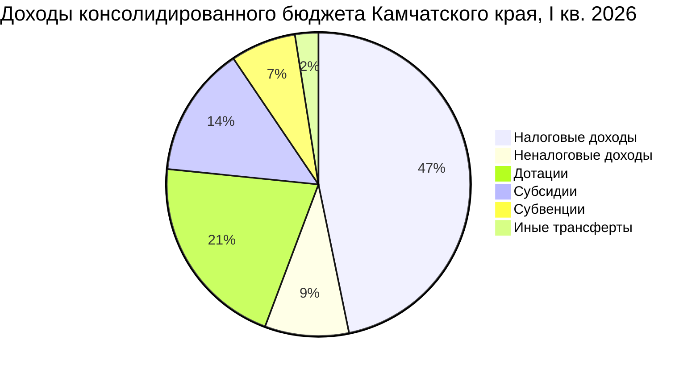
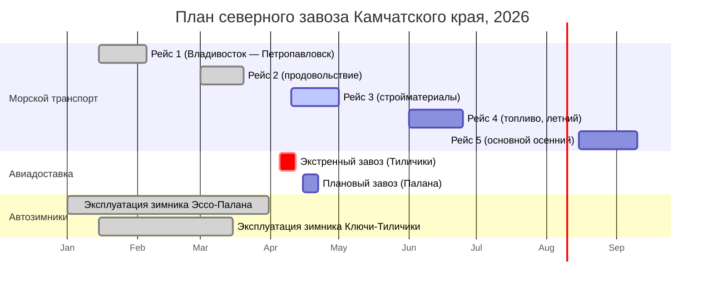
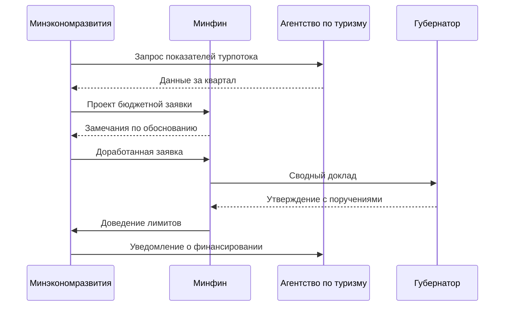

# Примеры Mermaid-диаграмм для госуправления

**Документ для практики — Кейс 6 (визуализация)**

---

## Пример 1: Структура доходов бюджета

## Пример 2: Процесс рассмотрения обращения гражданина

```mermaid
flowchart TD
    A[Поступление обращения] --> B{Тип обращения}
    B -->|Жалоба| C[Регистрация в СЭД]
    B -->|Предложение| C
    B -->|Заявление| C
    C --> D[Определение исполнителя]
    D --> E{Срок по 59-ФЗ}
    E -->|Стандартное| F[30 дней]
    E -->|Срочное| G[15 дней]
    E -->|Особый контроль| H[7 дней]
    F --> I[Подготовка ответа]
    G --> I
    H --> I
    I --> J[Согласование руководителем]
    J --> K[Направление ответа заявителю]
    K --> L[Снятие с контроля]

    style A fill:#1e3a5f,stroke:#4a90d9
    style B fill:#2d1b4e,stroke:#8b5cf6
    style K fill:#1a4d2e,stroke:#22c55e
    style L fill:#1a4d2e,stroke:#22c55e
```

## Пример 3: Gantt-диаграмма — план мероприятий северного завоза

## Пример 4: Организационная структура (фрагмент)

```mermaid
graph TD
    GOV[Губернатор Камчатского края] --> VP1[Зам. председателя<br>Экономика и финансы]
    GOV --> VP2[Зам. председателя<br>Социальная политика]
    GOV --> VP3[Зам. председателя<br>Инфраструктура]

    VP1 --> MIN1[Минэкономразвития]
    VP1 --> MIN2[Минфин]
    VP1 --> AG1[Агентство по туризму]

    VP2 --> MIN3[Минобразования]
    VP2 --> MIN4[Минздрав]
    VP2 --> MIN5[Минсоцразвития]

    VP3 --> MIN6[Минстрой]
    VP3 --> MIN7[Минтранспорт]
    VP3 --> MIN8[Минприроды]

    style GOV fill:#1e3a5f,stroke:#4a90d9
    style VP1 fill:#2d1b4e,stroke:#8b5cf6
    style VP2 fill:#2d1b4e,stroke:#8b5cf6
    style VP3 fill:#2d1b4e,stroke:#8b5cf6
```

## Пример 5: Sequence-диаграмма — межведомственное согласование

