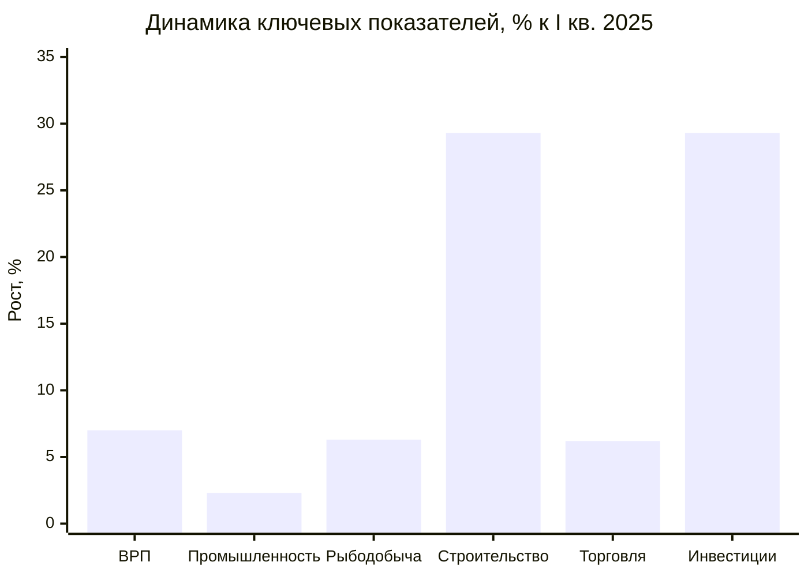
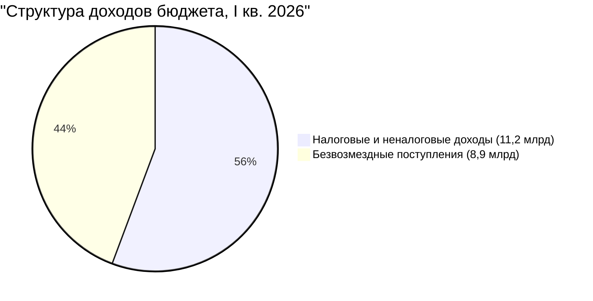
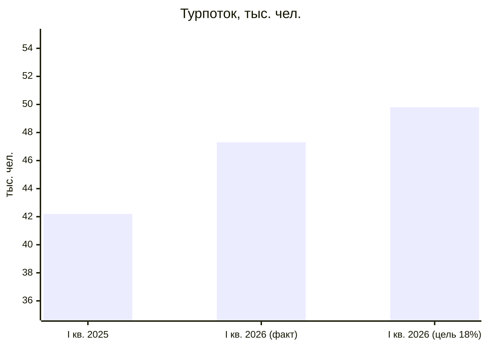
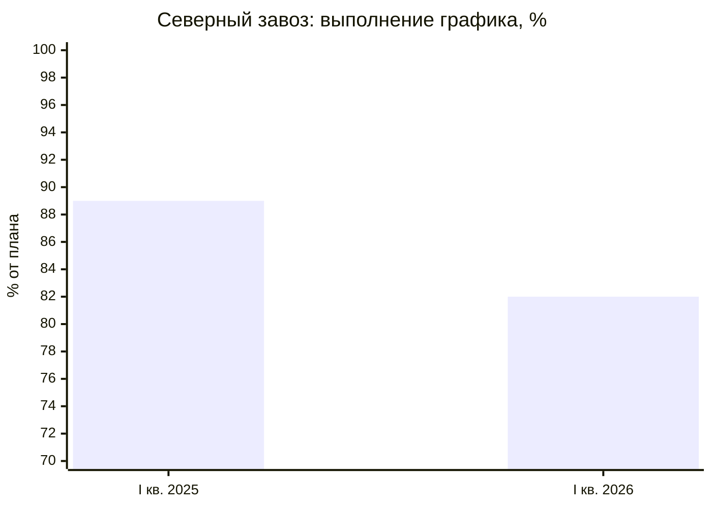

# Камчатский край: итоги I квартала 2026

Доклад о социально-экономическом развитии для расширенного заседания Правительства

---

## Ключевые показатели квартала

- **ВРП** — 73,2 млрд руб. (+7,0% к I кв. 2025)
- **Турпоток** — 47,3 тыс. чел. (+12,1%), но ниже целевого темпа 18%
- **Инвестиции** — 10,6 млрд руб. (+29,3%), опережающий рост
- **Дефицит бюджета** — 1,3 млрд руб. (ухудшение на 86% к прошлому году)

---

## Экономика: уверенный рост по всем секторам

- **Промышленное производство** — индекс 106,2% (план 104,0%), опережение на 2,2 п.п.
- **Рыбодобыча** — 438 тыс. тонн (+6,3%), на уровне 26,5% годового плана
- **Строительство** — 5,3 млрд руб. (+29,3%), драйвер — жилищное строительство и туристическая инфраструктура
- **Инвестиции в основной капитал** — 10,6 млрд руб., 22,1% от годового плана

| Показатель | I кв. 2025 | I кв. 2026 | Изменение |
|---|---|---|---|
| ВРП, млрд руб. | 68,4 | 73,2 | +7,0% |
| Промышленное производство, % | 103,8 | 106,2 | +2,4 п.п. |
| Рыбодобыча, тыс. тонн | 412 | 438 | +6,3% |
| Строительство, млрд руб. | 4,1 | 5,3 | +29,3% |
| Инвестиции, млрд руб. | 8,2 | 10,6 | +29,3% |

---

## Бюджет: доходы растут, но дефицит увеличивается

- **Доходы** — 20,1 млрд руб. (+9,2%), собственные доходы растут быстрее трансфертов
- **Расходы** — 21,4 млрд руб. (+12,0%), темп роста опережает доходы на 2,8 п.п.
- **Дефицит** увеличился с 0,7 до 1,3 млрд руб. — рост расходов на инфраструктуру и социальные обязательства
- **Госдолг** — 5,8 млрд руб. (+11,5%), соотношение долг/доходы — 28,9%

---

## Социальная сфера: позитивная динамика

- **Средняя зарплата** — 107 200 руб. (+8,9%), реальные доходы растут на 2,8%
- **Безработица** снизилась с 2,1% до 1,8% — исторический минимум
- **Демография** — естественная убыль сократилась на 6%, миграционный отток — на 21%
- Численность населения — 290,4 тыс. чел., темп убыли замедляется

| Показатель | I кв. 2025 | I кв. 2026 | Динамика |
|---|---|---|---|
| Зарплата, руб. | 98 400 | 107 200 | +8,9% |
| Безработица, % | 2,1 | 1,8 | -0,3 п.п. |
| Естественная убыль, чел. | -412 | -387 | улучшение |
| Миграционный отток, чел. | -1 240 | -980 | улучшение |

---

## Туризм: рост есть, но целевой темп не достигнут

- **Турпоток** — 47,3 тыс. чел. (+12,1%), при целевом росте 18% к аналогичному периоду
- **Загрузка** средств размещения — 71% (+7 п.п.), число объектов выросло на 16
- **Платные туруслуги** — 1,62 млрд руб. (+20,9%), темп роста выручки опережает турпоток
- Для достижения цели 18% необходим рост на 24% в оставшихся кварталах

---

## Инфраструктура: опережающий рост строительства и транспорта

- **Авиапассажиры** — 91,2 тыс. чел. (+16,3%), эффект новых рейсов из Москвы и Новосибирска
- **Грузооборот морского транспорта** — 162 тыс. тонн (+11,7%)
- **Ввод жилья** — 18,7 тыс. кв. м (+50,8%), рекордный показатель для I квартала
- **Газификация** — 54,3% населённых пунктов (+2,2 п.п.)

| Показатель | I кв. 2025 | I кв. 2026 | Рост |
|---|---|---|---|
| Авиапассажиры, тыс. | 78,4 | 91,2 | +16,3% |
| Морские грузы, тыс. т | 145 | 162 | +11,7% |
| Ввод жилья, тыс. кв. м | 12,4 | 18,7 | +50,8% |
| Газификация, % | 52,1 | 54,3 | +2,2 п.п. |

---

## Северный завоз: ситуация требует экстренных мер

- **Объём завоза** снизился на 7,0% — 31,8 тыс. тонн против 34,2 тыс. тонн
- **Выполнение графика** — 82% от плана (было 89%), отставание нарастает
- **Средняя задержка** выросла с 8 до 14 дней, число н.п. с перебоями — с 3 до 7
- **Причины**: сложная ледовая обстановка, нехватка судов ледового класса, срыв контрактов с перевозчиками

**Предлагаемые экстренные меры:**
1. Авиадоставка критических грузов в 7 пострадавших населённых пунктов
2. Привлечение дополнительного судна ледового класса для рейса в Олюторский район
3. Создание межведомственного штаба по контролю графика поставок

---

## Проблемные зоны: показатели с отклонениями

| Показатель | Факт | Ориентир | Отклонение | Причина |
|---|---|---|---|---|
| Турпоток, рост % | +12,1% | +18,0% | -5,9 п.п. | Задержка ввода ТРК, дефицит номерного фонда |
| Северный завоз, % плана | 82% | 100% | -18 п.п. | Ледовая обстановка, нехватка судов |
| Задержка поставок, дней | 14 | 8 | +6 дней | Логистические срывы |
| Н.п. с перебоями | 7 | 0 | +7 | Олюторский, Тигильский районы |
| Дефицит бюджета, млрд | -1,3 | -0,7 | -0,6 | Опережающий рост расходов |
| Госдолг, млрд | 5,8 | 5,2 | +0,6 | Привлечение заимствований |

---

## Выводы и предложения Правительству

**1. Северный завоз — экстренные меры**
Организовать авиадоставку продовольствия в 7 пострадавших населённых пунктов. Создать межведомственный штаб по контролю графика. Срок: немедленно.

**2. Туризм — корректировка плана**
Фактический рост турпотока (+12,1%) ниже целевого (+18%). Ускорить ввод объектов размещения и запуск электронного бронирования ООПТ к летнему сезону.

**3. Бюджетная устойчивость**
Дефицит вырос на 86%. Провести ревизию расходных обязательств и определить источники покрытия до конца II квартала.
